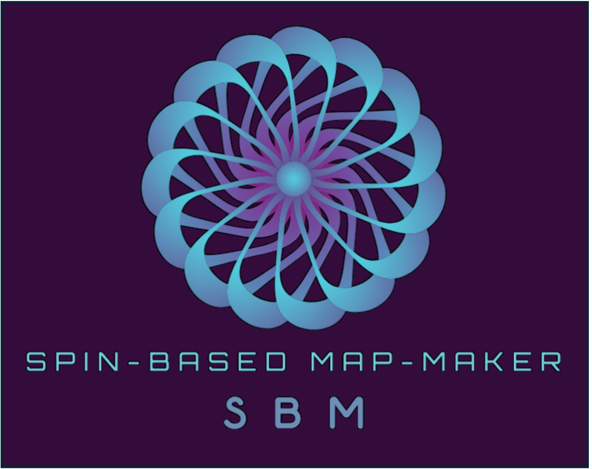

# Spin-based map-making simulation

<p align="center">
  
</p>

<p align="center">
  <h1>
  
  </h1>
</p>

[](https://yusuke-takase.github.io/SBM/index.html)


This code assesses the impact of differential systematics on CMB polarisation observations.

`ScanFields` such as hit-map and cross-link map, pre-simulated by [Falcons.jl](https://github.com/yusuke-takase/Falcons.jl), are coupled with sky temperature and polarization fields, including systematics effects, at a given $spin$.

# Instllation

```
git clone https://github.com/yusuke-takase/SBM.git
cd SBM
pip install -e .
```

# How to load cross-link HDF5 file 
SBM assumes the HDF5 file includes cross-link is generated `Falcons.jl`'s [pipelines.jl](https://github.com/yusuke-takase/Falcons.jl/blob/master/src/function/pipelines.jl)
In order to load the HDF5 file, SBM surpports two methods:

1. Specify directpath
  - `sbm.read_scanfiled(file_path)`
  - This way is usefull if you don't need to do multiple detector's simulation
2. Specify channel and detector name of LiteBIRD
  - `sbm.ScanFields.load_det(filename=f"{channel}/{detector_name}", base_path="<root path of your dataset>")`
  - In this way, if you don't specify the `base_path`, the code will read `~/.config/sbm_dataset/sbm_dataset.toml`.
  The `base_path` is written in this toml file. 
  This toml file is generated after you installed the cross-link dataset's `base_path` by:
  ```
  python -m sbm.install_db
  ```
  This way makes you free to put long file path to specify a detector. 

# Database instllation

The SBM can access to a database which includes cross-link data in HDF5 format.
This way is useful people who wants to do full-scale detector simulation.
Not in that case, it may be better to use just `sbm.read_scanfiled(file_path)`.

By following command, you can install the path of database in local storage.

```
python -m sbm.install_db
```

# Tutorials

There are several tutorials in the [notebooks](https://github.com/yusuke-takase/SBM/tree/master/notebooks).
Although you need to download the required ScanFields datased given by Falcons, you can simulate any time-independent systematics if you have a signal model.
Now, following systematics are implemented:

- Differential gain
- Differential pointing
- Absolute pointing offset with HWP [Y. Takase et al.](https://arxiv.org/abs/2408.03040)
- HWP non-ideality [G. Patanchon et al.](https://iopscience.iop.org/article/10.1088/1475-7516/2024/04/074)
- Diff. beam
- Diff. beam ellip.
- Bandpass mismatch (related with diff. gain)
- Pointing disturbance due to HWP
  - wedge effect (THWP)
  - tilted effect (RHWP)
- Non-uniform white noise

# How to cite the code
The basic formalism is published in [Y. Takase et al.](https://arxiv.org/abs/2408.03040). 
Please cite the paper when you use the SBM for your publications. 
