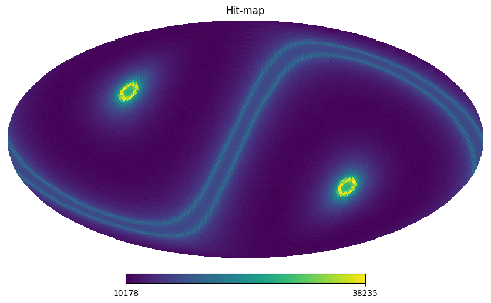
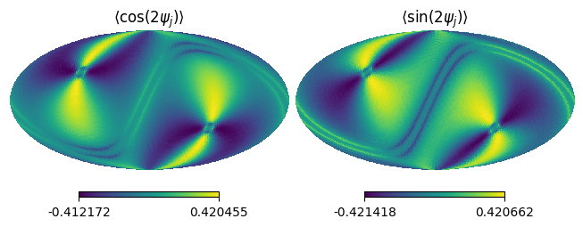
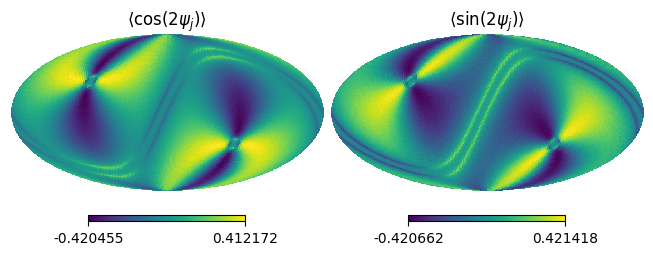

ScanFields
==========

After installting a cross-link databese saved in HDF5 format, we can load every infomation related with scanning strategy such as a hit-map and cross-link map.
This information will be an object by :class:`sbm.ScanFields` class. The following code snippet shows how to access the hit-map and cross-link map.

Hit-map
~~~~~~~

This is a code sample to access the hit-map:

.. code-block:: python

    import numpy as np
    import healpy as hp
    import matplotlib.pyplot as plt
    import sbm
    from sbm import ScanFields

    test_xlink_path = "sbm/tests/nside_32_boresight_hwp.h5"
    sf_test = sbm.read_scanfiled(str(test_xlink_path))
    hp.mollview(sf_test.hitmap, title="Hit-map")
    display(sf_test.ss)

.. code::

    {'alpha': 45.0,
    'beta': 50.0,
    'coord': b'G',
    'duration': 31536000,
    'gamma': 0.0,
    'hwp_rpm': 61.0,
    'name': array([b'boresight'], dtype=object),
    'nside': 32,
    'prec_rpm': 0.005198910308399359,
    'sampling_rate': 5.0,
    'spin_rpm': 0.05,
    'start_angle': 0.0,
    'start_point': b'equator'}

Cross-link
~~~~~~~~~~

Also, we can access the cross-link map as follows:

.. code-block:: python

    xlink2 = sf_test.get_xlink(2, 0) # n=2, m=0
    hp.mollview(xlink2.real, title=r"$\langle \cos(2\psi_j) \rangle$", sub=(1,2,1))
    hp.mollview(xlink2.imag, title=r"$\langle \sin(2\psi_j) \rangle$", sub=(1,2,2))

If we want to have a cross-link simulated by orthogonal pair detector, we can use :meth:`.ScanFields.t2b()`.
This method apply the exponential factor to rotate the phase of detector as:

.. math::

    {}_{n,m}\tilde{h}^{(\texttt{B})} = {}_{n,m}\tilde{h}^{(\texttt{T})}e^{i n \frac{\pi}{2}}.

.. code-block:: python

    xlink2 = sf_test.t2b().get_xlink(2, 0) # n=2, m=0
    hp.mollview(xlink2.real, title=r"$\langle \cos(2\psi_j) \rangle$", sub=(1,2,1))
    hp.mollview(xlink2.imag, title=r"$\langle \sin(2\psi_j) \rangle$", sub=(1,2,2))

Covariance matrix
~~~~~~~~~~~~~~~~~
By combining cross-links using :meth:`.ScanFields.create_covmat()`, we can create covariance matrix to reconstruct signals.
For instance, if we want to reconstruct the *spin-0* and *spin-2* field, we can use the following code snippet:

.. code-block:: python

    spin_n_basis = [0, 2, -2] # spin-n
    spin_m_basis = [0, 0, 0]  # spin-m
    C = sf_test.create_covmat(spin_n_basis, spin_m_basis)

``C`` is a :math:`3\times3\times N_{\rm pix}` `numpy.ndarray` though we can see the analytical covariance matrix :math:`C` by

.. code-block:: python

    display(sf_test.model_covmat())

Output:

.. math::

    \left[\begin{matrix}1 & \frac{{}_{-2,0}\tilde{h}}{2} & \frac{{}_{2,0}\tilde{h}}{2}\\\frac{{}_{2,0}\tilde{h}}{2} & \frac{1}{4} & \frac{{}_{4,0}\tilde{h}}{4}\\\frac{{}_{-2,0}\tilde{h}}{2} & \frac{{}_{-4,0}\tilde{h}}{4} & \frac{1}{4}\end{matrix}\right]
