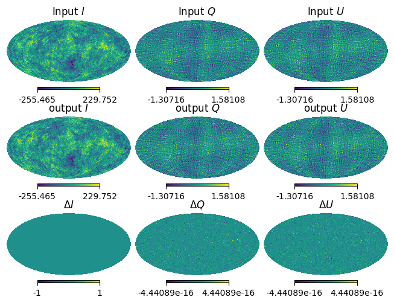

SignalFields and map-making
============

:class:`.SignalFields` is a class to handle a signal :math:`\tilde{S}` in spin space.

A field what we have to give to SBM is :math:`{}_{n,m}\tilde{S}`, which is a map in spin space.
For example, the ideal bolometric equation at a sky pixel :math:`\Omega` is given by

.. math::
    S(\Omega,\psi,\phi) & = I(\Omega) + Q(\Omega)\cos(4\psi-2\psi) + U(\Omega)\sin(4\psi-2\psi)\\
                   & = I(\Omega) + \frac{1}{2}P(\Omega)e^{-i(4\psi-2\psi)}+ \frac{1}{2}P^{*}(\Omega)e^{i(4\psi-2\psi)},

where :math:`I`, :math:`Q`, and :math:`U` are Stokes parameters, :math:`P` is polarization with complex
format defined as :math:`P=Q+iU`, and :math:`\psi` and :math:`\phi` are the detector's crossing angle and the HWP angle, respectively.
We can decompose this signale filed to spin space by Fourier transform :math:`(\psi,\phi) \to (n,m)` as

.. math::
    {}_{0,0}\tilde{S}(\Omega) &= I, \\
    {}_{2,-4}\tilde{S}(\Omega) &= \frac{1}{2}P, \\
    {}_{-2,4}\tilde{S}(\Omega) &= \frac{1}{2}P^{*}.

To constract the ``SignalFields`` object by this analytical model and perform a map-making, we can use the following code snippet:

.. code-block:: python

    import numpy as np
    import healpy as hp
    import matplotlib.pyplot as plt
    from sbm import Field, ScanFields, SignalFields
    import sbm

    r = 0.0
    nside = 32
    input_map = sbm.generate_cmb(nside, r, cmb_seed=12345)
    I = input_map[0]
    P = input_map[1] + 1.0j * input_map[2]

    # User should define the signal field in spin space given by analytical bolometric equation
    signal_field = SignalFields(
        Field(I, spin_n=0, spin_m=0),
        Field(P / 2, spin_n=2, spin_m=-4),
        Field(P.conj() / 2, spin_n=-2, spin_m=4),
    )

    path = "sbm/tests/nside_32_boresight_hwp.h5" # you should specify the path to the scan field
    sf = sbm.read_scanfiled(path)

    s_00 = signal_field.get_coupled_field(sf, spin_n_out=0, spin_m_out=0)    # {}_{0,0}\tilde{S}^{d}(\Omega)
    s_p2m4 = signal_field.get_coupled_field(sf, spin_n_out=2, spin_m_out=-4) # {}_{2,-4}\tilde{S}^{d}(\Omega)

    fields = [s_00, s_p2m4, s_p2m4.conj()]

    # Prepare the linear system: Ax=b; b corresponds to `fields`
    signal_field.build_linear_system(fields)

    output_map = sf.map_make(signal_field, only_iqu=True, show_eq=True)
    residual = input_map - output_map

    hp.mollview(input_map[0], title="Input $I$", sub=(3, 3, 1))
    hp.mollview(input_map[1], title="Input $Q$", sub=(3, 3, 2))
    hp.mollview(input_map[1], title="Input $U$", sub=(3, 3, 3))

    hp.mollview(output_map[0], title="output $I$", sub=(3, 3, 4))
    hp.mollview(output_map[1], title="output $Q$", sub=(3, 3, 5))
    hp.mollview(output_map[1], title="output $U$", sub=(3, 3, 6))

    hp.mollview(residual[0], title="$\Delta I$", sub=(3, 3, 7))
    hp.mollview(residual[1], title="$\Delta Q$", sub=(3, 3, 8))
    hp.mollview(residual[1], title="$\Delta U$", sub=(3, 3, 9))

Because of we do not induce any systematics here, the output map is almost the same as the input map and no residuals.

This code solves the map-making equation :math:`Ax=b` with ideal signal model through covariance matrix, :math:`A` given by the scan field, ``sf``.

Ones the user defined the vector :math:`b` which is the field what we want to reconstruct by using :meth:`.SignalFields.get_coupled_field()` and :meth:`.SignalFields.build_linear_system()`, :meth:`.ScanFields.map_make()` will calculate the covariance matrix automatically, and solve the equation.

So what user have to do is just to define the signal field in spin space and give it to the map-making procedure.

As a user friendly function, ``show_eq=True`` option in :meth:`.ScanFields.map_make()` will show the equation of the map-making in the console.
In the snippet above, the equation is shown as follows:

.. math::

    \left[\begin{matrix}\hat{I}\\\hat{P}\\\hat{P^*}\end{matrix}\right] = \left[\begin{matrix}1 & \frac{{}_{-2,4}\tilde{h}}{2} & \frac{{}_{2,-4}\tilde{h}}{2}\\\frac{{}_{2,-4}\tilde{h}}{2} & \frac{1}{4} & \frac{{}_{4,-8}\tilde{h}}{4}\\\frac{{}_{-2,4}\tilde{h}}{2} & \frac{{}_{-4,8}\tilde{h}}{4} & \frac{1}{4}\end{matrix}\right]^{-1} \left[\begin{matrix}{}_{0,0}\tilde{S^d}\\{}_{2,-4}\tilde{S^d}\\{}_{-2,4}\tilde{S^d}\end{matrix}\right]

This equation is stored in the ``ScanFields`` object as a latex format, and it can be accessed by ``ScanFields.map_maker``.

Several tutorials are available which treat some systematic effects in `notebooks <https://github.com/yusuke-takase/SBM/tree/master/notebooks>`_.
